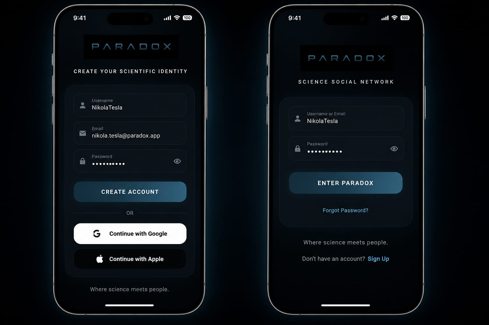
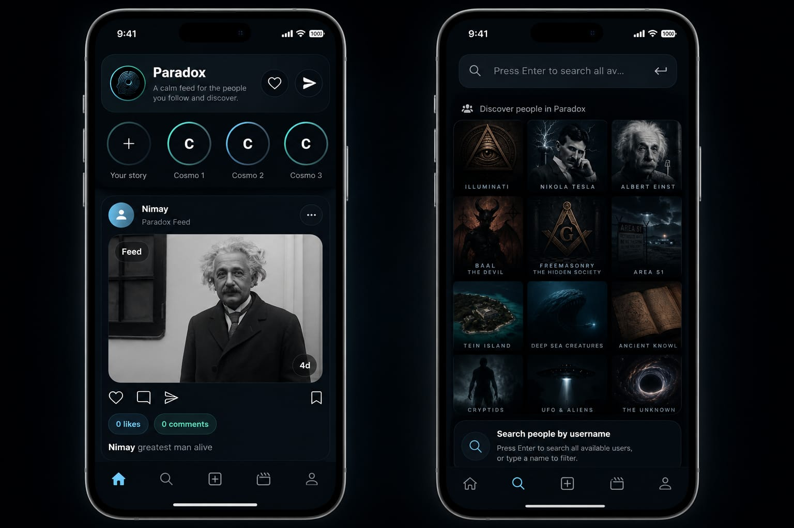
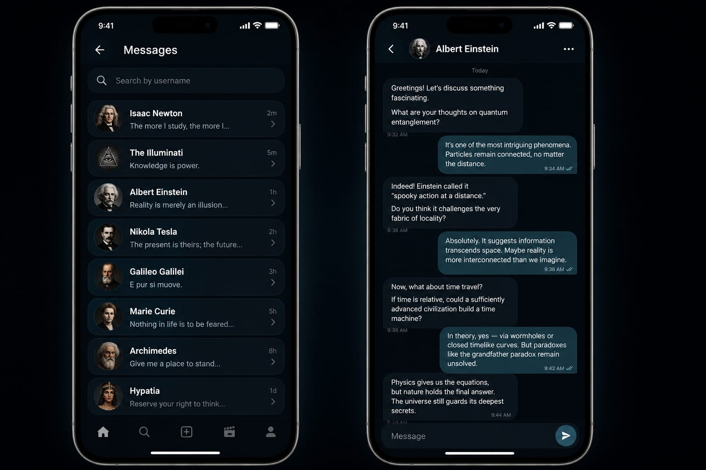

# Paradox

Paradox is a Flutter social app built with Firebase for authentication, chat, feed posts, profile management, media uploads, and release distribution.

## Highlights

- Email, username, and Google sign-in flows
- Real-time feed and post creation
- Direct chat with unread tracking and message deletion controls
- Profile screen with profile photo updates
- Firebase Storage and Cloudinary-based media handling
- Firestore-backed app release card for sharing APK download links

## Screenshots

<p>
  
  
  
  
</p>

## Tech Stack

- Flutter / Dart
- Firebase Auth
- Cloud Firestore
- Firebase Storage
- Cloudinary
- Shared Preferences
- Image Picker and image cropping/editor flow

## Public Repo Guidelines

This repository is intended to contain app source code only. Do not commit local or secret-only files such as:

- `android/local.properties`
- `android/key.properties`
- `.env` files
- keystore files like `*.jks` or `*.keystore`
- build output folders such as `build/` and `.dart_tool/`

The Firebase Android config file `android/app/google-services.json` is part of the app setup and can stay in the repository.

## Release Download Link

Paradox includes an in-app release card that reads the latest Android build info from Firestore.

Update this document to publish a new download link:

- Collection: `app_releases`
- Document: `android_latest`
- Fields:
  - `versionName` string, for example `1.0.1`
  - `versionCode` number, for example `2`
  - `downloadUrl` string, direct APK link
  - `notes` string, optional release notes
  - `isMandatory` bool, optional forced-update flag
  - `releasedAt` timestamp, optional

The profile screen shows the current installed version, the latest release info, and buttons to open or copy the download link.

## Local Setup

1. Install Flutter and Android Studio.
2. Run `flutter pub get`.
3. Connect Firebase for Android using your own project settings.
4. Set Cloudinary values at build time if you use media uploads:

```powershell
flutter run --dart-define=CLOUDINARY_CLOUD_NAME=YOUR_CLOUD_NAME --dart-define=CLOUDINARY_UPLOAD_PRESET=YOUR_UNSIGNED_PRESET
```

## Build

```powershell
flutter build apk --release
```

The APK will be created at:

`build/app/outputs/flutter-apk/app-release.apk`

## Notes

The app is designed for sharing with friends and family through a direct APK link or Firebase App Distribution.
